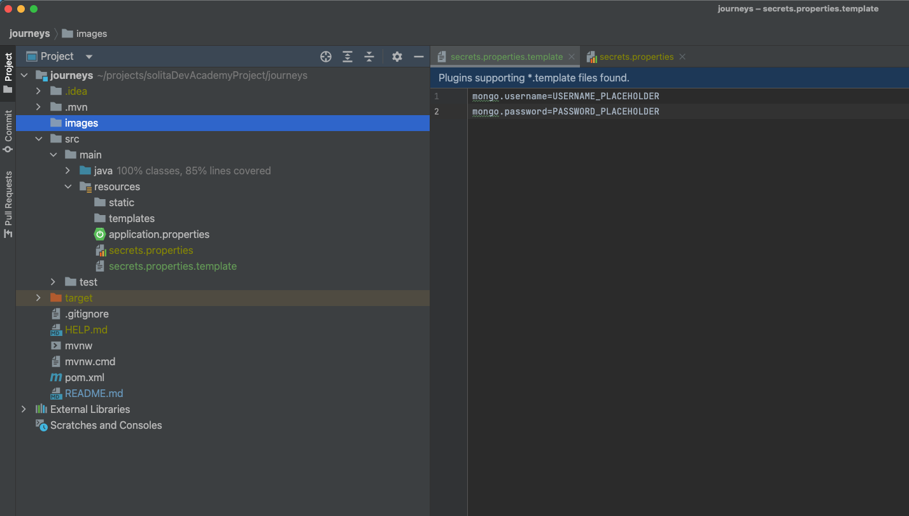
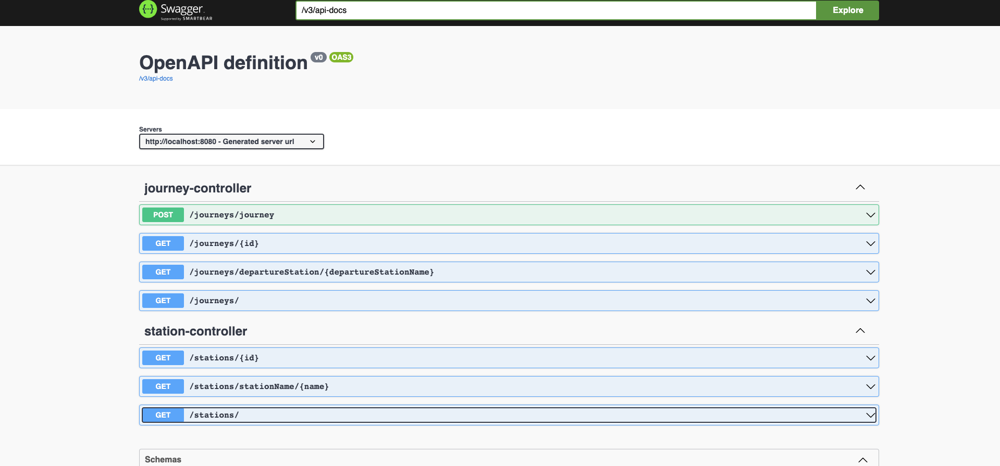

# JOURNEYS 🚴

**Full stack application with Java Springboot backend and [React frontend](https://github.com/heliDevine/journeys-frontend)**

The application fetches and processes some data from journeys made with city bikes and the bike stations. 
Head to the frontend repo [readme](https://github.com/heliDevine/journeys-frontend/blob/main/README.md) to read more about the concept for the web client.
The backend was developed with this concept in mind to service frontend with relevant data but leaving enough 
abstraction when/if frontend client's needs grow and change. 

## Technology 

### Stack
- Java 17
- Springboot 3
- Testing : JUnit & Mockito
- Libraries: Lombok to reduce boilerplate and Jackson to serialize/deserialize.
- Database : MongoAtlas

Application follows Springboot convention of separating the concerns. Repository layer handles database queries and aggregation, 
service layer business logic and controllers the api.

Data import and validation: Mongo Compass was used to import the datasets. I changed a few keys for clarity and used jsonSchema for the validation
to exclude short journeys. I only imported May 2021 journeys datasets as MongoAtlas free tier has size limit. 

`{ $jsonSchema: { properties: { distance: { minimum: 10 }, duration: { minimum: 10 } } } }`'

I excluded unnecessary fields on the repository layer from the data which made it clearer for dedicated endpoints to provide relevant data. 

At the moment the linked frontend client uses 2 endpoints GET/journeys and GET/stations. GetAllJourneys method fetches 
all journeys from database, the results are paginated with optional page sizes and excludes return time, and station ids. Sending these to 
frontend would have added extra bulk as the datasets are already large. GetAllStations method fetches all stations with added fields of total distance of journeys departing from the station 
and the total counts of journeys from and to station. Mongo methods and aggregation pipeline was used to process these calculations.
These results are paginated too and irrelevant fields filtered out. 

I added POST journey endpoint with request body for departure and return stations, duration and distance. 
Reasoning behind this decision was to reduce the input fields for the journey as timestamp can be generated and an individual user wouldn't need to
worry about stationID's or address, those values wouldn't change and can be pulled from the database. I used  DTOs for 
Journey to decouple the database entity from the HTTP request body and the response. This way only relevant fields are needed
for the input and client will receive calculated values from the service. 

The other endpoints are shown on the below table and mainly used during the development and testing but would be useful for future features.

| HTTP | endpoint                                          | method                            | params               |
|------|---------------------------------------------------|-----------------------------------|----------------------|
| GET  | /journeys                                         | getAllJourneys                    | pageNo,pageSize      |
| GET  | /journeys {id}                                    | getById                           | id                   |
| GET  | /journeys/departureStation/{departureStationName} | getJourneysByDepartureStationName | departureStationName |
| POST | /journeys/journey                                 | createJourney                     | journeyRequestDTO    |
| GET  | /stations                                         | getAllStations                    | pageNo,pageSize      |
| GET  | /stations/{id}                                    | getById                           | id                   |
| GET  | /stationName/{name}                               | getStationByName                  | stationName          |

## Run the application

///// NOT READY YET 

On command line run following: 
- clone this repo by command `git clone git@github.com:heliDevine/journeys.git` 
- navigate to the directory : `cd journeys`
- Database username and password are not in the GitHub repo, so they need to be added manually. Amend secrets.properties file: remove ".template" form the file name and add replace username and password with correct values.

### Docker container
- You will need [Docker](https://docs.docker.com/get-docker/) running on your machine. Check if you already have it by running
`docker --version` command on CLI. If not, download it from the Docker site.
- run with command `docker-run........`

FINISH THIS SECTION

### On your own machine

If you go for this option I assume you have development environment set up already, such as Homebrew for Mac. 
This is Java Springboot application built with Maven, so it needs following to be installed 
- Java 17 JDK, follow the guide from this 
[link](https://docs.oracle.com/en/java/javase/17/install/overview-jdk-installation.html#GUID-8677A77F-231A-40F7-98B9-1FD0B48C346A)
- Maven build tool, download and install latest from [here](https://maven.apache.org/download.cgi)
- From command line `mvn spring-boot:run` to run the application. This will run Springboot logs and takes a few moments. Head to your default browser
http://localhost:8080/swagger-ui/index.html and you should see this Swagger UI 

- 

## Use the application

FINISH THIS SECTION 

`mvn spring-boot:run`

`mvn run`

### Testing

Junit and Mockito are used to test the service methods and controllers. The test can be run with command `mvn test`.
The test coverage is 85%,  some methods are not fully tested.  

## Project status

The project is currently MVP, it works as intended and as described above. However, several features could be added to improve it. Some are listed
in issues in this repo which I kept as to-do list whilst working. If/when I have time I'd prioritise developing following:
- improve error/exception handling, the backend should inform client clearly when things go wrong.
- add functionality that Users can add, delete and amend their journeys and Admin users can add, delete and amend both journeys and stations. So login
and security features are needed to give permissions for different users.
- fix inconsistencies in the code and tests. For example create DTOs for GET endpoints. 
- improve testing and run database in test container

**Author: Heli Devine**